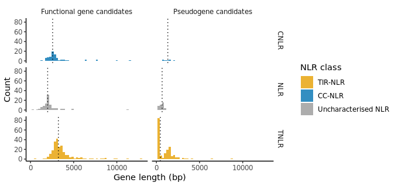

# Introduction
## NLR Analysis in *Brassica napus*

Nucleotide-binding leucine-rich repeat (NLR) proteins are a key class of disease resistance 
genes in plants, playing a central role in detecting pathogens and triggering immune responses. 
In canola (*Brassica napus*), characterising the NLR repertoire is important for understanding 
and improving resistance to devastating fungal and bacterial diseases such as blackleg and 
clubroot.

This project aims to:
1. Identify and annotate NLR genes in the *B. napus* genome, 
2. Classify NLRs into functional genes and non-functional pseudogenes aswell as functional classes (TIR-NLRs, CC-NLRs, and RPW8-NLRs)
3. Explores their evolutionary relationships through 
phylogenetic tree analysis.

# Tools I used
For this project, I utlised a variety of tools:
- **NLR-Annotator** by [Steuernagel et al., 2020](https://doi.org/10.1104/pp.19.01273) for NLR gene identification and annotation.
- **R** for data analysis and visualisation
- 
# The Analysis
## 1. Download and unzip *Brassica napus* Whole Genome Sequence (WGS) from European Nucleotide Archive (ENA)

```bash
wget ftp://ftp.ebi.ac.uk/pub/databases/ena/wgs/public/ccc/CCCW01.fasta.gz

gunzip CCCW01.fasta.gz
```
## 2. Identify NLR entries in Brassica napus WGS using NLR-Annotator. <br>
The NLR-Annotator is a tool designed to identify and annotate NLR (Nucleotide-binding Leucine-rich repeat) genes in plant genomes. It uses conserved Nucleotide-Binding ARCs as anchors, then searches flanking regions for other NLR-associated motifs to delineate the boundaries of each NLR gene. The tool outputs the identified NLR genes in various formats, including GFF, BED, and FASTA used for various downstream analyses.

```bash
java -Xmx8000M -jar /path/to/NLR-Annotator-v2.1b.jar -i CCCW01.fasta -x /path/to/mot.txt -y /path/to/store.txt -o output.txt -g output.gff -b output.bed -m output.motifs.bed -a output.nbarkMotifAlignment.fasta

# add header to the output.txt file
sed -i '1s/^/scaffold_id\tgene_id\tdomain_class\tstart\tend\tstrand\tmotifs\n/' output.txt
```

## 3. Data analysis of NLR entries using R

### Total number of NLR genes identified in *Brassica napus* WGS
```R
df_nlr <- read.table('output.txt', header = TRUE)

# total count of NLR entries
nrow(df_nlr)

# total count of NLR entries by domain class
sort(table(df_nlr$domain_class), decreasing = TRUE)

# Classify entries into complete and partial NLRs.
df_nlr$gene_type <- ifelse(df_nlr$domain_class %in% c("TIR-NBARC-LRR", "NBARC-LRR", "CC-NBARC-LRR"), 
                           "complete", "partial") # the assumption is that complete NLRs contain both NB-ARC and LRR

# Further classify NLRs into class-types (T-NLR, C-NLR, and NLR). NLR-Annotator does not have the resolution to distinguish RPW8-NLRs, so they will be classified as NLRs or CC-NLRss.
df_nlr$nlr_class <- ifelse(grepl("TIR", df_nlr$domain_class), "TNLR",
                           ifelse(grepl("CC", df_nlr$domain_class), "CNLR", "NLR"))

# Calculate gene length
df_nlr$gene_length <- df_nlr$end - df_nlr$start + 1

# strand distribution by gene completeness and class
table(df_nlr$strand, df_nlr$gene_type)
table(df_nlr$strand, df_nlr$nlr_class)

chisq.test(table(df_nlr$strand, df_nlr$gene_type)) #test for strand bias across complete vs partial NLRs
chisq.test(table(df_nlr$strand, df_nlr$nlr_class)) #test for strand bias across NLR classes

# Determine total NLRs per scaffold
nlr_per_scaffold <- rowSums(table(df_nlr$scaffold_id, df_nlr$nlr_class))

# Number of scaffolds with n NLRs
table(nlr_per_scaffold)

# Finding the scaffold with 8 NLRs
df_nlr[df_nlr$scaffold_id == "ENA|CCCW010043234|CCCW010043234.1", 
       c("gene_id", "domain_class", "start", "end", "strand", "nlr_class", "gene_type")]
```
### Results
629 NLR entries were identified in the *Brassica napus* WGS. The distribution of NLR entries is as follows:

| Domain Architecture | Count |
|---|---|
| TIR-NBARC-LRR | 232 |
| NBARC-LRR | 95 |
| TIR | 91 |
| TIR-NBARC | 82 |
| CC-NBARC-LRR | 76 |
| NBARC | 39 |
| CC-NBARC | 9 |
| TIR-LRR | 5 |

| Type | Count |
|---|---|
| Complete | 403 |
| Partial | 226 |

| Class | Complete | Partial |
|---|---|---|
| CNLR | 76 | 9 |
| NLR | 95 | 39 |
| TNLR | 232 | 178 |



| | Complete | Partial |
|---|---|---|
| **-** | 203 | 123 |
| **+** | 200 | 103 |

| | CNLR | NLR | TNLR |
|---|---|---|---|
| **-** | 44 | 69 | 213 |
| **+** | 41 | 65 | 197 |

*Chi-squared tests indicate no significant strand bias across complete vs partial NLRs (p = 0.996) or across NLR classes (p = 0.372).*

| Cluster size | 1 | 2 | 3 | 4 | 5 | 6 | 7 | 8 |
|---|---|---|---|---|---|---|---|---|
| Scaffolds | 365 | 63 | 25 | 5 | 7 | 0 | 0 | 1 |

*Total number of unique scaffolds with NLRs: 466, most NLRs are by themselves*

| gene_id | domain_class | start | end | strand | nlr_class | gene_type |
|---|---|---|---|---|---|---|
| CCCW010043234.1_nlr1 | TIR-NBARC | 102195 | 103503 | + | TNLR | partial |
| CCCW010043234.1_nlr2 | TIR-NBARC | 113810 | 115753 | + | TNLR | partial |
| CCCW010043234.1_nlr3 | TIR-NBARC | 123492 | 124612 | + | TNLR | partial |
| CCCW010043234.1_nlr4 | TIR-NBARC | 130481 | 131811 | + | TNLR | partial |
| CCCW010043234.1_nlr5 | TIR-NBARC | 134736 | 135957 | + | TNLR | partial |
| CCCW010043234.1_nlr6 | TIR-NBARC | 138102 | 139200 | + | TNLR | partial |
| CCCW010043234.1_nlr7 | TIR-NBARC-LRR | 103142 | 111396 | - | TNLR | complete |
| CCCW010043234.1_nlr8 | TIR-NBARC-LRR | 94910 | 99191 | - | TNLR | complete |

*The scaffold with the most NLRs (8) contains only TIR-NLRs, all of which are partial (on the + strand), except for 2 complete NLRs (on the - strand).*

## 4. Align NLR sequences


# Conclusion