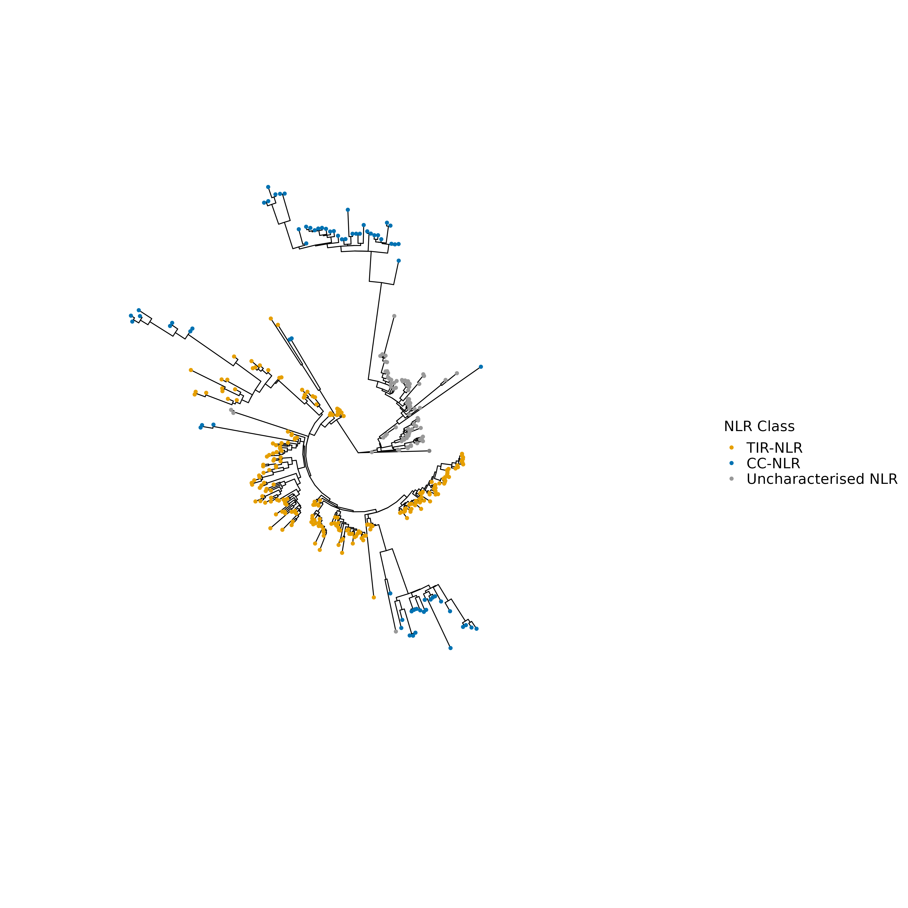
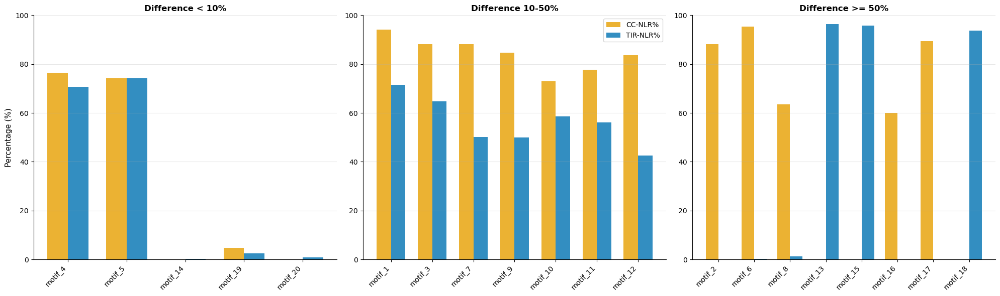

# Introduction
## NLR Analysis in *Brassica napus*

Nucleotide-binding leucine-rich repeat (NLR) proteins are a key class of disease resistance 
genes in plants, playing a central role in detecting pathogens and triggering immune responses. 
In canola (*Brassica napus*), characterising the NLR repertoire is important for understanding 
and improving resistance to devastating fungal and bacterial diseases such as blackleg and 
clubroot.

This project aims to:
1. Identify and annotate NLR genes in the *B. napus* genome, 
2. Classify NLRs into functional genes and non-functional pseudogenes aswell as functional classes (TIR-NLRs, CC-NLRs, and RPW8-NLRs)
3. Explores their evolutionary relationships through 
phylogenetic tree analysis.

# Tools we used
For this project, we utlised a variety of tools:
- **NLR-Annotator v2.1b** by [Steuernagel et al., 2020](https://doi.org/10.1104/pp.19.01273) for NLR gene identification and annotation.
- **R 4.1.2** for data analysis and visualisation
- **MAFFT v7.490** for multiple sequence alignment of NB-ARC domains
- **IQ-TREE  v2.0.7** for phylogenetic tree construction
- **Python v3.13.9** for data visualisation
# The Analysis
## 1. Download and unzip *Brassica napus* Whole Genome Sequence (WGS) from European Nucleotide Archive (ENA)

```bash
wget ftp://ftp.ebi.ac.uk/pub/databases/ena/wgs/public/ccc/CCCW01.fasta.gz

gunzip CCCW01.fasta.gz
```
## 2. Identify NLR entries in Brassica napus WGS using NLR-Annotator. <br>
The NLR-Annotator is a tool designed to identify and annotate NLR (Nucleotide-binding Leucine-rich repeat) genes in plant genomes. It uses conserved Nucleotide-Binding ARCs as anchors, then searches flanking regions for other NLR-associated motifs to delineate the boundaries of each NLR gene. The tool outputs the identified NLR genes in various formats, including GFF, BED, and FASTA used for various downstream analyses.

```bash
java -Xmx8000M -jar /path/to/NLR-Annotator-v2.1b.jar -i CCCW01.fasta -x /path/to/mot.txt -y /path/to/store.txt -o output.txt -a output.nbarkMotifAlignment.fasta

# add header to the output.txt file
sed -i '1s/^/scaffold_id\tgene_id\tdomain_class\tstart\tend\tstrand\tmotifs\n/' output.txt
```

## 3. Data analysis of NLR entries using R

### Total number of NLR genes identified in *Brassica napus* WGS
```R
df_nlr <- read.table('output.txt', header = TRUE)

# total count of NLR entries
nrow(df_nlr)

# total count of NLR entries by domain class
sort(table(df_nlr$domain_class), decreasing = TRUE)

# Classify entries into complete and partial NLRs.
df_nlr$gene_type <- ifelse(df_nlr$domain_class %in% c("TIR-NBARC-LRR", "NBARC-LRR", "CC-NBARC-LRR"), 
                           "complete", "partial") # the assumption is that complete NLRs contain both NB-ARC and LRR

# Further classify NLRs into class-types (T-NLR, C-NLR, and NLR). NLR-Annotator does not have the resolution to distinguish RPW8-NLRs, so they will be classified as NLRs or CC-NLRss.
df_nlr$nlr_class <- ifelse(grepl("TIR", df_nlr$domain_class), "TNLR",
                           ifelse(grepl("CC", df_nlr$domain_class), "CNLR", "NLR"))

# Calculate gene length
df_nlr$gene_length <- df_nlr$end - df_nlr$start + 1

# strand distribution by gene completeness and class
table(df_nlr$strand, df_nlr$gene_type)
table(df_nlr$strand, df_nlr$nlr_class)

chisq.test(table(df_nlr$strand, df_nlr$gene_type)) #test for strand bias across complete vs partial NLRs
chisq.test(table(df_nlr$strand, df_nlr$nlr_class)) #test for strand bias across NLR classes

```
### Results
629 NLR entries were identified in the *Brassica napus* WGS. The distribution of NLR entries is as follows:

| Domain Architecture | Count |
|---|---|
| TIR-NBARC-LRR | 232 |
| NBARC-LRR | 95 |
| TIR | 91 |
| TIR-NBARC | 82 |
| CC-NBARC-LRR | 76 |
| NBARC | 39 |
| CC-NBARC | 9 |
| TIR-LRR | 5 |

| Type | Count |
|---|---|
| Complete | 403 |
| Partial | 226 |

| Class | Complete | Partial |
|---|---|---|
| CNLR | 76 | 9 |
| NLR | 95 | 39 |
| TNLR | 232 | 178 |


| | Complete | Partial |
|---|---|---|
| **-** | 203 | 123 |
| **+** | 200 | 103 |

| | CC-NLR | Uncharacterised NLR | TIR-NLR |
|---|---|---|---|
| **-** | 44 | 69 | 213 |
| **+** | 41 | 65 | 197 |

*Chi-squared tests indicate no significant strand bias across complete vs partial NLRs (p = 0.996) or across NLR classes (p = 0.372).*

## 4. Allign NB-ARC domain sequences using MAFFT 
MAFFT is a widely used tool for multiple sequence alignment. NB-ARC domain protein sequences were used as input, producing an aligned protein sequence output. The --localpair option is used for sequences that are expected to have local similarities, while --maxiterate allows for up to 1000 iterations to refine the alignment, improving accuracy. The --reorder option groups similar sequences together in the output alignment.
```bash
mafft --localpair --maxiterate 1000 --reorder output.nbarkMotifAlignment.fasta > mafft_aligned_nbarc.fasta
```

## 5. Construct phylogenetic tree using IQ-TREE and visualise using ggtree 
IQ-TREE constructs a maximum likelihood phylogenetic tree from the aligned NB-ARC domain sequences. The -m TEST option enables automatic selection of the best-fit substitution model, while -B 1000 and -alrt 1000 perform ultrafast bootstrap and SH-aLRT tests with 1000 replicates each to assess branch support. The -T AUTO option allows IQ-TREE to automatically determine the optimal number of CPU threads. 

```bash
iqtree2 -s mafft_aligned_nbarc.fasta -m TEST -B 1000 -alrt 1000 -T AUTO
```
```R
#import libraries
library(ape)
library(ggtree)
library(ggplot2)

df_annot$nlr_label <- recode(df_annot$nlr_class,
                             "TNLR" = "TIR-NLR",
                             "CNLR" = "CC-NLR",
                             "NLR"  = "Uncharacterised NLR",
                             "NA"   = "Uncharacterised NLR"
)

ggtree(tree, layout = "circular") %<+% df_annot +
  geom_tippoint(aes(color = nlr_label), size = 1.5) +
  scale_color_manual(values = c(
    "TIR-NLR"             = "#E69F00",
    "CC-NLR"              = "#0072B2",
    "Uncharacterised NLR" = "#999999"
  )) +
  labs(color = "NLR Class") +
  theme(legend.position = "right")

# Find bootstrap support values for the first branch in the tree
first_branch_label <- tree$node.label[2]
print(first_branch_label)

```
### Results.

*A pylogentic tree was constructed using NB-ARC domain protein sequences of 375 complete NLRs. The bootstrap support values for the first branch in the tree is 94% (ultrafast bootstrap) and 93% (SH-aLRT), indicating very strong support for this branch.*

## 6. Identify clusters of NLRs across the genome
```R
# Determine total NLRs per scaffold
nlr_per_scaffold <- rowSums(table(df_nlr$scaffold_id, df_nlr$nlr_class))

# Number of scaffolds with n NLRs
table(nlr_per_scaffold)

# Finding the scaffold with 8 NLRs
df_nlr[df_nlr$scaffold_id == "ENA|CCCW010043234|CCCW010043234.1", 
       c("gene_id", "domain_class", "start", "end", "strand", "nlr_class", "gene_type")]
```

## Results
| Cluster size | 1 | 2 | 3 | 4 | 5 | 6 | 7 | 8 |
|---|---|---|---|---|---|---|---|---|
| Scaffolds | 365 | 63 | 25 | 5 | 7 | 0 | 0 | 1 |
*Total number of unique scaffolds with NLRs: 466 and most NLRs are by themselves*

| scaffold_id | domain_class | start | end | strand | nlr_class | gene_type |
|---|---|---|---|---|---|---|
| CCCW010043234.1_nlr1 | TIR-NBARC | 102195 | 103503 | + | TNLR | partial |
| CCCW010043234.1_nlr2 | TIR-NBARC | 113810 | 115753 | + | TNLR | partial |
| CCCW010043234.1_nlr3 | TIR-NBARC | 123492 | 124612 | + | TNLR | partial |
| CCCW010043234.1_nlr4 | TIR-NBARC | 130481 | 131811 | + | TNLR | partial |
| CCCW010043234.1_nlr5 | TIR-NBARC | 134736 | 135957 | + | TNLR | partial |
| CCCW010043234.1_nlr6 | TIR-NBARC | 138102 | 139200 | + | TNLR | partial |
| CCCW010043234.1_nlr7 | TIR-NBARC-LRR | 103142 | 111396 | - | TNLR | complete |
| CCCW010043234.1_nlr8 | TIR-NBARC-LRR | 94910 | 99191 | - | TNLR | complete |

*10043234.1 is the scaffold with the most NLRs (8) contains only TIR-NLRs, 6 of which are partial (on the + strand), and 2 which are complete NLRs (on the - strand).*

## 7. Compare motifs in CC-NLRs vs TIR-NLRs
```R
# Import libraries
library(tidyr)

# Explode motifs colum
df_nlr_long <- df_nlr %>%
  separate_rows(motifs, sep = ",")

# remove duplicates
df_nlr_long <- df_nlr_long %>% distinct(gene_id, motifs, nlr_class, .keep_all = TRUE)

#count motifs by class
motif_counts_by_class <- df_nlr_long %>%
  group_by(nlr_class,motifs) %>%
  summarise(count = n(), .groups = 'drop') 
```
```python
# Visualise using pyton
# Import libraries
import pandas as pd 
import matplotlib.pyplot as plt 
import numpy as np

# Define total counts of CC and TIR NLRs
cc_total = 85
tir_total = 410

# Pivot 
df_pivot = df_plot.pivot_table(index='motifs', columns='nlr_class', values='count', fill_value=0)

# Calculate percentages
df_pivot['CC-NLR%'] = df_pivot['CNLR'] / cc_total * 100
df_pivot['TIR-NLR%'] = df_pivot['TNLR'] / tir_total * 100

# Sort by motif number
df_pivot['motif_num'] = df_pivot.index.str.extract(r'motif_(\d+)', expand=False).astype(int)
df_pivot = df_pivot.sort_values('motif_num')

# Plot barchart
fig, ax = plt.subplots(figsize=(10, 6))
x = np.arange(len(df_pivot))
width = 0.35

ax.bar(x - width/2, df_pivot['CC-NLR%'], width, label='CC-NLR', color='#0072B2', alpha=0.8)
ax.bar(x + width/2, df_pivot['TIR-NLR%'], width, label='TIR-NLR', color='#E69F00', alpha=0.8)

ax.set_xlabel('Motif', fontsize=12)
ax.set_ylabel('Percentage (%)', fontsize=12)
ax.set_xticks(x)
ax.set_xticklabels(df_pivot.index, rotation=45, ha='right')  
ax.legend()
ax.grid(False)  

plt.tight_layout()
plt.show()
```
## Results


# Conclusion
1. **NLR Diversity and Structural Completeness**
The Brassica napus genome contains 629 NLR genes with distinct structural classes, TIR-NLR (410), CC-NLR (85), uncharacterised NLR (134), further classified as either complete (403) or partial (226). This diversity reflects both functional NLR genes and pseudogenised copies, indicating ongoing evolution of this crucial immune gene family.
2. **Evolutionary Origins and Phylogenetic Structure**
Phylogenetic analysis of NB-ARC domains reveals two well-supported clades (bootstrap >90%), consistent with *B. napus* being an allotetraploid derived from two ancestral species (*B. rapa* and *B. oleracea*). Extensive sub-clade branching within each major clade indicates rapid NLR diversification, suggesting an ongoing pathogen-driven arms race that has generated functional diversity within each parental lineage.
3. **Class-Specific Motif Conservation and Genomic Clustering**
CC-NLRs and TIR-NLRs exhibit distinct motif signatures, suggesting functional divergence and class-specific selective pressures. NLR clustering on individual scaffolds (up to 8 tandem genes on one scaffold) indicates local gene duplication and pseudogenisation events, driving NLR family expansion and generating structural diversity across the genome.